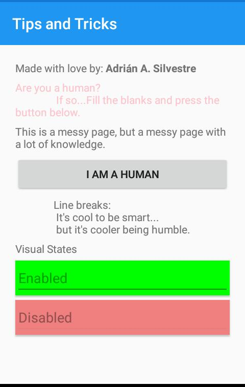
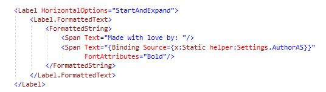
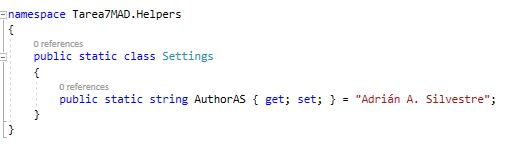
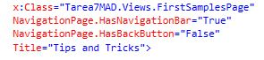
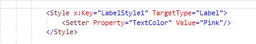
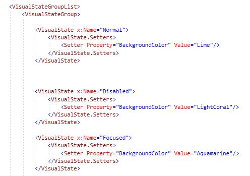
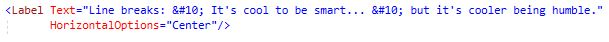

# Tarea7MAD
 Seventh assignment for Mobile Apps Development. Using Xamarin Tips and Tricks
 
 The main porpouse of this assignment was to put in practice some Xamarin Tips and Tricks.
 
 ### Some screenshots
 
 **App screen**\
\

**Tip 1: Using String Formatting; Tip 2:  Using static properties**\
\
\

**Tip 3: Using Attached Properties**
\

**Tip 4: Adding generic styles**
\

**Tip 7: Triggers (and styles)**
\

**Tip 9: Line break**
\
